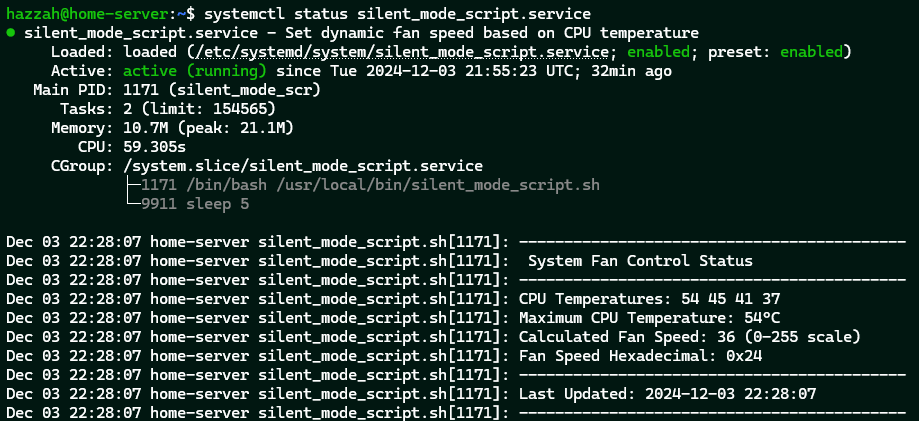

# IBM x3650 M4 Silent Mode
The silent_mode_script is a lightweight Bash script designed to dynamically control system fan speeds based on CPU temperatures. It runs as a background service (silent_mode_script.service) using systemd, ensuring it starts on boot and operates continuously, keeping your system quiet while optimizing cooling efficiency.

## Installation 

You can run the following steps to install the script and made it run at startup : 

```
# Download the script
sudo curl -fsSLo /usr/local/bin/silent_mode_script.sh https://raw.githubusercontent.com/harryludemann/ibm-x3650-m4-silent-mode/main/silent_mode_script.sh

# Mark Executable
sudo chmod +x /usr/local/bin/silent_mode_script.sh

# Download the service definition
sudo curl -fsSLo /etc/systemd/system/silent_mode_script.service https://raw.githubusercontent.com/harryludemann/ibm-x3650-m4-silent-mode/main/silent_mode_script.service

# Make ipmitool password-less sudo by adding the line to visudo
sudo visudo
root ALL=(ALL) NOPASSWD: /usr/bin/ipmitool

# Reload systemctl scripts
sudo systemctl daemon-reload

# Register and start the service
sudo systemctl enable --now silent_mode_script

# Check Logs
sudo journalctl -u silent_mode_script -n 20
systemctl status silent_mode_script.service
```

## Customize the curve
You can edit the script located at /usr/local/bin/silent_mode_script.sh to adjust the temperature values and fan speed curve as needed.
Important values you can change are:
- MIN_TEMP=30: This sets the minimum temperature threshold.
- MAX_TEMP=80: This sets the maximum temperature threshold.
- SCALING_FACTOR=0.3: This adjusts the scaling factor used to determine the fan speed, allowing you to make the system quieter or provide more aggressive cooling.   

To tweak the fan speed curve to better suit your requirements, modify the logic in the script's else block where fan speed is calculated based on the CPU temperature.

## System Utilization


### CPU Usage
- The script primarily operates in an idle state, waking every 15 seconds to:
    - Query CPU temperature data via ipmitool.
    - Calculate the appropriate fan speed.
    - Apply the fan speed settings.
- Over a 32-minute runtime, the script utilized approximately 59 seconds of CPU time, equating to roughly 3% of a single CPU core.
- This low CPU usage is achieved by efficiently sleeping between operations (sleep 15) and performing only lightweight computations when active.
### Memory Usage
- The script consumes 10.7 MB of memory during normal operation, with a peak usage of 21.1 MB.
- This memory footprint is negligible and ensures compatibility with systems of all sizes, including those with limited resources.
### Task Count
- The service runs with 2 tasks:
    - The main bash process that executes the script logic.
    - A sleep process, which keeps the script dormant between execution cycles to conserve CPU resources.

## Notes
- This script is specifically designed for IBM x3650 M4 servers, utilizing ipmitool to control fan speeds.
- Make sure your system has ipmitool installed and properly configured for the script to operate correctly.
- Always test any changes to fan control parameters carefully to avoid overheating or excess noise.

## Troubleshooting
- Failed to retrieve IPMI sensor data: Make sure ipmitool has the correct permissions and that your server supports the necessary IPMI commands.
- Service not starting: Check the status using systemctl status silent_mode_script.service and review any errors in the logs using journalctl.

For additional help, open an issue on the GitHub repository.